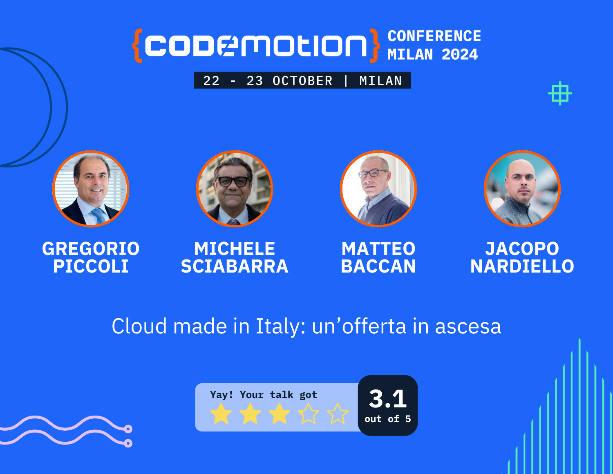

# Codemotion2024

Slide presentate al panel: Cloud made in Italy: un’offerta in ascesa

Gregorio Piccoli [Zucchetti](https://www.zucchetti.it/),
Michele Sciabarra [OpenServerless](https://openserverless.apache.org/),
Jacopo Nardiello [KubernetesFury](https://docs.kubernetesfury.com/),
Matteo Baccan (Il contestatore)

In un panorama tecnologico globale caratterizzato dalla presenza di grandi player internazionali, l'ecosistema cloud italiano si sta facendosi strada come un centro di innovazione, superando le aspettative e avendo la sua parte negli standard nel settore. Questo panel riunisce rappresentanti di diverse realtà italiane per esplorare l'avanguardia tecnologica del cloud made in Italy, evidenziando la complessità e la flessibilità delle soluzioni sviluppate nel nostro paese.

Sala SAGITTARIUS - Mercoledì 23 Ottobre 2024 - Ore 15:30 - 16:15

__[Scarica gratuitamente le slide](https://raw.githubusercontent.com/matteobaccan/Codemotion2024/main/Cloud%20italiano.pptx)__

## Slide scartate

Avevo preparato anche delle slide per raccontare una ipotetica esperienza di startup che si affida a servizi serverless per la propria infrastruttura e poi si trova a dover fare i conti con i limiti di questi servizi.

Per questione di spazio e tempo non sono state presentate, ma le metto comunque a disposizione.

__[La storia di Mario](https://raw.githubusercontent.com/matteobaccan/Codemotion2024/main/LOdissea-Serverless-di-Mario-Una-Storia-di-Startup.pptx)__

## Ruoli

Il panel era un dibattito fra sostenitori del serverless/cloud, che venivano incalzati da domande di aziende che erano contrarie o si erano trovate male con queste architetture.

Il mio ruolo era quello di contestare le scelte per far capire che non basta dire "sono serverless" o "sono in cloud", occorre un cambio di approccio per poter sfruttare a pieno questo tipo di architetture.

## Votazione

Alla fine del panel c'è stata una votazione per capire se il pubblico fosse più propenso a scegliere soluzioni cloud/serverless o soluzioni tradizionali.

## Eventi

Se volete rimanere aggiornati sugli eventi ai quali partecipo potete guardare questo repository

[Tutti i miei eventi](https://github.com/matteobaccan/Eventi)

## Qualche foto

*Noi quattro*

*Io (seduto) e Gregorio a parlare*

*Michele risponde a una mia domanda*

